<!-- markdownlint-disable-file -->
# AWSKRUG #gudi(구로디지털) 모임

- since 2017
- [AWSKRUG Facebook Link](https://www.facebook.com/groups/awskrug/)
- [AWSKRUG Meetup Link](https://www.meetup.com/ko-KR/awskrug/)
- [AWSKRUG Web Site](http://www.awskr.org/)
- [AWSKRUG Slack Channel LInk](http://awskrug.slack.com)

# 모임 일시
  - 매월 `셋째주 화요일`에 **구로디지털단지** 공간대여가 가능한 곳 어디서든 진행합니다
  - ~~**구로디지털단지** 근처 평균 10~20인실 수용 가능한 공간 지원 해 주실 분 두팔벌려 환영합니다 👍~~

# 발표자 보상
  - AWSKRUG모임에서 발표를 하시는 분들은 AWS 크레딧을 드리니 많이 발표지원 해주세요~ (크레딧 금액은 사정상 달라질 수 있음)
  - [발표에 대한 부담감에 대해서](https://github.com/awskrug/gudi-group/issues/1)

# Meetups
## 2021년

  
42th meetup - <b>언택트 시대에 말 수가 현격히 줄어 입이 근질근질한 분들을 위한 잡담</b>

  ### `42th meetup`
  - **주최**
    - [2021년 03월 16일 / Amazon Chime Online Meeting](https://www.meetup.com/ko-KR/awskrug/events/276848045/)
  - **주제**
    - 업무경험을 윤택하게 해 주는 도구나 가구 추천
    - 재택근무를 하면서 나태해 지지 않게 일 하는 방법
    - 스터디의 동기부여를 얻는 방법
    - 구인 구직
    - 개발고민 상담
  - **모임 토론 자료**
    - [줍할만한 키워드와 정보가 공유된 슬라이드](https://drive.google.com/file/d/1Jqs_dBam9Ru_rCz-gkOHHZRFk8SrcvPS/view?usp=sharing)

  
41th meetup - <b>AWS 자격증, AWS Community Builders 소개 및 후기</b>

  ### `41th meetup`
  - **주최**
    - [2021년 02월 17일 / Amazon Chime Online Meeting](https://www.meetup.com/ko-KR/awskrug/events/276244891/)
  - **주제**
    1. 주제발표-1
        - [`류한진`](https://www.meetup.com/ko-KR/awskrug/members/217184134/)님 - AWS 자격증 살펴보기
    2. 라이트닝 토크-1
        - [`김태웅`](https://www.meetup.com/ko-KR/awskrug/members/249419691/)님 - AWS Solutions Acrhitect Associate 자격증 후기
    3. 주제발표-2
        - [`박태성`](https://www.meetup.com/ko-KR/awskrug/members/184515293/)님 - [AWS Community Builders 소개 & AWS Associate Developer 자격증 후기](https://geoseong.github.io/docs/aws/certified-dev-associate)
    4. 라이트닝 토크-2
        - [`류한진`](https://www.meetup.com/ko-KR/awskrug/members/217184134/)님 - AWS Advanced Networking specialty 자격증 후기
    5. 라이트닝 토크-3
        - [`정도현`](https://www.meetup.com/ko-KR/awskrug/members/216996214/)님 - AWSKRUG #cert 채널 및 [자격증 취득 모임](https://www.meetup.com/ko-KR/awskrug/events/276358190/) 소개

## 2020년

  
40th meetup - <b>Amazon VPC Deep Dive: ENI 를 알면 VPC 가 보인다</b>

  ### `40th meetup`
  - **주최**
    - [2020년 11월 17일 / Amazon Chime Online Meeting](https://www.meetup.com/ko-KR/awskrug/events/274484412/)
  - **주제**
    - 발표
      - [`김태우`](https://www.meetup.com/ko-KR/awskrug/members/281643910/profile/)님 - [Amazon VPC Deep Dive: ENI 를 알면 VPC 가 보인다](https://speakerdeck.com/twkiiim/amazon-vpc-deep-dive-eni-reul-almyeon-vpc-ga-boinda)

  
39th meetup - <b>개발자들이 알아두면 좋을 기본적인 네트워크 지식</b>

  ### `39th meetup`
  - **주최**
    - [2020년 10월 20일 / Amazon Chime Online Meeting](https://www.meetup.com/ko-KR/awskrug/events/273699098/)
  - **주제**
    - 발표
      - `서대호`님 - [개발자들이 알아두면 좋을 기본적인 네트워크 지식](https://docs.google.com/presentation/d/1oof9IUxEH_UahZbrbiZ5uUvHAotwS4-9_kVGvri1_Pw/edit?usp=sharing)

  
38th meetup - <b>구디모임 방향성 재수립</b>

  ### `38th meetup`
  - **주최**
    - [2020년 09월 10일 / Amazon Chime Online Meeting](https://www.meetup.com/ko-KR/awskrug/events/272930494/)
  - **주제**
    - 발표
      - [역대 구디모임 회고, 모임 방향에 대한 공지](https://docs.google.com/presentation/d/1TX25ZhEFwI_xvc8EWimzXeOlrRUN4vlO0NKTPQ8oSyo/edit?usp=sharing)
    - 자유토론
      - 네트워킹 및 다음 주제 논의: 라이브코딩, 패널토크, 삽질후기 등

    &nbsp;&nbsp;&nbsp;&nbsp;&nbsp;&nbsp;&nbsp;&nbsp;
    
    
     
    &nbsp;&nbsp;&nbsp;&nbsp;&nbsp;&nbsp;&nbsp;&nbsp;
    
    
     

  
37th meetup - <b>AWS 기반 서버리스 아키텍쳐 톺아보기</b>

  ### `37th meetup`
  - **주최**
    - [2020년 05월 19일 / Amazon Chime Online Meeting](https://www.meetup.com/ko-KR/awskrug/events/270600402/)
  - **주제**
    - 발표
      - [`김태우`](https://www.meetup.com/ko-KR/awskrug/members/281643910/profile/)님 - [AWS 기반 서버리스 아키텍쳐 톺아보기](https://dev.classmethod.jp/articles/awskrug-gudi-37-serverless/)
    - 자유토론
      - [Amplify API with Auth directive 스터디 문서](https://www.notion.so/geoseong/Auth-d5b57c8a5c8544f0a925b404fa302549)

  &nbsp;&nbsp;&nbsp;&nbsp;&nbsp;&nbsp;&nbsp;&nbsp;
  
  
   
  &nbsp;&nbsp;&nbsp;&nbsp;&nbsp;&nbsp;&nbsp;&nbsp;
  
   

  
36th meetup - <b>집단지성: "모니터링, IAM, CI/CD기법에 대하여"</b>

  ### `36th meetup`
  - **주최**
    - [2020년 04월 21일 / Amazon Chime Online Meeting](https://www.meetup.com/ko-KR/awskrug/events/269948676/)
  - **주제**
    - [집단지성: "모니터링, IAM, CI/CD기법에 대하여"](https://docs.google.com/presentation/d/1lhmNRqBNq0h2nw6ktvahASahy1rpqGm5RyjTpQ7V-kY/edit#slide=id.p)
      - 모니터링 스터디내용 공유와 사용기법에 대한 내용 공유
        - Mackerel (Slack@twkiiim)
        - O'Reilly SRE 책의 주요 내용 공유 (Slack@wonderwall)
        - 참여자 토론
          - 모니터링 서비스들 공유
      - IAM 사용기법
        - IAM Best Practices & 교차계정 접근법 공유 (Slack@PaPabongo)
        - 참여자 토론
          - Trusted Advisor, IAM의 Access Analyzer에 대한 토론
      - CI/CD 구축기법
        - 사내 BitBucket Pipeline 세팅 및 구축법 공유 (Slack@geoseong)
        - BitBucket Pipeline 배포법 공유 (Slack@yunzema)
          - Vue Frontend AWS S3 배포
          - AWS ECR Docker Image Push
        - 참여자 토론
          - Git 협업방법
      - 자유토론
        - Serverless & CDK
          - [Nordic Serverless - AWS CDK and Amazon EventBridge](https://www.youtube.com/watch?v=31l3T-e0Voc)
          - [Full Stack Development in the Era of Serverless Computing: Nader Dabit](https://egghead.io/lessons/egghead-egghead-talks-full-stack-development-in-the-era-of-serverless-computing)
        - AWS 스터디 자료
          - [classmethod: 일본어버전이지만 한국어 번역이 용이함](https://dev.classmethod.jp/)

  
35th meetup - <b>토론회: 2020년 주목해 볼 AWS 주요 고객 사례 모음</b>

  ### `35th meetup`
  - **주최**
    - [2020년 03월 17일 / Amazon Chime Online Meeting](https://www.meetup.com/ko-KR/awskrug/events/269376958/)
  - **주제**
    - [토론회: "2020년 주목해 볼 AWS 주요 고객 사례 모음"](https://aws.amazon.com/ko/blogs/korea/2019-customer-cases/)
      - AWS의 블로그 내용을 훑어보고 참가자들의 관심사에 따라 내용 중 하나를 즉흥적으로 정하여 토론

  
34th meetup - <b>Amazon Cognito로 시도 해 보는 다양한 방법의 소셜 로그인</b>

  ### `34th meetup`
  - **주최**
    - [2020년 02월 18일 / 서울특별시 구로구 디지털로26길 123 지플러스타워 14층 플레이오토 세미나실](https://www.meetup.com/ko-KR/awskrug/events/268558188/)
  - **주제**
    - 발표
      - [`박태성`](https://www.meetup.com/ko-KR/awskrug/members/184515293/profile)님 - [Amazon Cognito로 시도 해 보는 다양한 방법의 소셜 로그인](https://medium.com/@parkopp/amazon-cognito%EB%A1%9C-%EC%8B%9C%EB%8F%84-%ED%95%B4-%EB%B3%B4%EB%8A%94-%EB%8B%A4%EC%96%91%ED%95%9C-%EB%B0%A9%EB%B2%95%EC%9D%98-%EC%86%8C%EC%85%9C-%EB%A1%9C%EA%B7%B8%EC%9D%B8-f81fa00b8c2e)

  &nbsp;&nbsp;&nbsp;&nbsp;&nbsp;&nbsp;&nbsp;&nbsp;
  
  
   
  &nbsp;&nbsp;&nbsp;&nbsp;&nbsp;&nbsp;&nbsp;&nbsp;
  
   
  &nbsp;&nbsp;&nbsp;&nbsp;&nbsp;&nbsp;&nbsp;&nbsp;
  
   

  
33th meetup - <b>AWS EKS 톺아보기 Part 3</b> & <b>AWS Amplify로 클라우드 기반 모바일 앱 개발하기</b>

  ### `33th meetup`
  - **주최**
    - [2020년 01월 22일 / 서울특별시 구로구 디지털로26길 123 지플러스타워 14층 플레이오토 세미나실](https://www.meetup.com/ko-KR/awskrug/events/267715088/)
  - **주제**
    - 발표
      - [`심호진`](https://www.meetup.com/ko-KR/awskrug/members/249060449/)님 - [AWS EKS 톺아보기 Part 3](https://github.com/stevenshim/eks-hands-on/blob/master/description/part3)
      - [`박태성`](https://www.meetup.com/ko-KR/awskrug/members/184515293/profile)님 - [AWS Amplify로 클라우드 기반 모바일 앱 개발하기](https://github.com/geoseong/study-amplify-with-react-native)

  &nbsp;&nbsp;&nbsp;&nbsp;&nbsp;&nbsp;&nbsp;&nbsp;
  
  
   
  &nbsp;&nbsp;&nbsp;&nbsp;&nbsp;&nbsp;&nbsp;&nbsp;
  
   
  &nbsp;&nbsp;&nbsp;&nbsp;&nbsp;&nbsp;&nbsp;&nbsp;
  
  
   
  &nbsp;&nbsp;&nbsp;&nbsp;&nbsp;&nbsp;&nbsp;&nbsp;
  
   
  &nbsp;&nbsp;&nbsp;&nbsp;&nbsp;&nbsp;&nbsp;&nbsp;
  
   

## 2019년

  
32th meetup - <b>인턴도 할 수 있는 Prometheus & 사용기</b>

  ### `32th meetup`
  - **주최**
    - [2019년 11월 12일 / 서울특별시 구로구 디지털로26길 123 지플러스타워 14층 플레이오토 세미나실](https://www.meetup.com/ko-KR/awskrug/events/266039576/)
  - **주제**
    - 발표
      - [`한상효`](https://www.meetup.com/ko-KR/awskrug/members/267185743/profile/)님 - [인턴도 할 수 있는 Prometheus & 사용기](https://www.slideshare.net/SangHyoHan1/awskrug-prometheus-sanghyo-han)

  &nbsp;&nbsp;&nbsp;&nbsp;&nbsp;&nbsp;&nbsp;&nbsp;
  
  
   
  &nbsp;&nbsp;&nbsp;&nbsp;&nbsp;&nbsp;&nbsp;&nbsp;
  
  
  &nbsp;&nbsp;&nbsp;&nbsp;&nbsp;&nbsp;&nbsp;&nbsp;
  

  
31th meetup - <b>AWS EKS 톺아보기 Part 2 - EKS 잘써보기 (Hands-on 포함)</b>

  ### `31th meetup`
  - **주최**
    - [2019년 10월 18일 / 서울특별시 구로구 디지털로26길 123 지플러스타워 14층 플레이오토 세미나실](https://www.meetup.com/ko-KR/awskrug/events/265497395/)
  - **주제**
    - 발표
      - [`심호진`](https://www.meetup.com/ko-KR/awskrug/members/249060449/)님 - [AWS EKS 톺아보기 Part 2 - EKS 잘써보기 (Hands-on 포함)](https://github.com/stevenshim/eks-hands-on/tree/master/description/part2)

  &nbsp;&nbsp;&nbsp;&nbsp;&nbsp;&nbsp;&nbsp;&nbsp;
  
  
   
  &nbsp;&nbsp;&nbsp;&nbsp;&nbsp;&nbsp;&nbsp;&nbsp;
  
  
  &nbsp;&nbsp;&nbsp;&nbsp;&nbsp;&nbsp;&nbsp;&nbsp;
  
  
  &nbsp;&nbsp;&nbsp;&nbsp;&nbsp;&nbsp;&nbsp;&nbsp;
  
  

  
30th meetup - <b>AWS EKS 톺아보기 Part 1 - EKS 구축하기 (Hands-on 포함)</b>

  ### `30th meetup`
  - **주최**
    - [2019년 9월 17일 / 서울특별시 구로구 디지털로26길 123 지플러스타워 14층 플레이오토 세미나실](https://www.meetup.com/ko-KR/awskrug/events/264512802/)
  - **주제**
    - 발표
      - [`심호진`](https://www.meetup.com/ko-KR/awskrug/members/249060449/)님 - [AWS EKS 톺아보기 Part 1 - EKS 구축하기 (Hands-on 포함)](https://github.com/stevenshim/eks-hands-on/tree/master/description/part1)

  &nbsp;&nbsp;&nbsp;&nbsp;&nbsp;&nbsp;&nbsp;&nbsp;
  
  
   
  &nbsp;&nbsp;&nbsp;&nbsp;&nbsp;&nbsp;&nbsp;&nbsp;
  

  
29th meetup - <b>serverless framework 으로 남몰래 서비스 만들고 지워보기: HandsOn</b>

  ### `29th meetup`
  - **주최**
    - [2019년 8월 20일 / 서울특별시 구로구 디지털로26길 123 지플러스타워 14층 플레이오토 세미나실](https://www.meetup.com/ko-KR/awskrug/events/263641033/)
  - **주제**
    - 발표
      - [`박태성`](https://www.meetup.com/ko-KR/awskrug/members/184515293/)님 - [serverless framework으로 남몰래 서비스 만들고 지워보기: HandsOn](https://github.com/geoseong/serverless-study/blob/master/docs/handson.md)

  
28th meetup - <b>serverless framework 으로 남몰래 서비스 만들고 지워보기</b>

  ### `28th meetup`
  - **주최**
    - [2019년 7월 16일 / 서울특별시 구로구 디지털로26길 123 지플러스타워 14층 플레이오토 세미나실](https://www.meetup.com/ko-KR/awskrug/events/262726764/)
  - **주제**
    - 발표
      - [`박태성`](https://www.meetup.com/ko-KR/awskrug/members/184515293/)님 - [serverless framework으로 남몰래 서비스 만들고 지워보기](https://www.slideshare.net/TaeSeongPark2/awskrug-serverless-framework)

  &nbsp;&nbsp;&nbsp;&nbsp;&nbsp;&nbsp;&nbsp;&nbsp;
  
  
   
  &nbsp;&nbsp;&nbsp;&nbsp;&nbsp;&nbsp;&nbsp;&nbsp;
  
  
   
  &nbsp;&nbsp;&nbsp;&nbsp;&nbsp;&nbsp;&nbsp;&nbsp;
  
  
   
  &nbsp;&nbsp;&nbsp;&nbsp;&nbsp;&nbsp;&nbsp;&nbsp;
  

  
27th meetup - <b>AWS load balancers deep dive</b> & <b>Terraform으로 AWS Lambda 활용 주기적으로 EC2를 AMI로 백업 하기</b>

  ### `27th meetup`
  - **주최**
    - [2019년 6월 11일 / 서울특별시 동작구 여의대방로 112 농심신대방사옥(도연관) 11층 대회의실](https://www.meetup.com/ko-KR/awskrug/events/261639589/)
  - **주제**
    - 발표
      - [`하수용`](https://www.meetup.com/ko-KR/awskrug/members/232491796/)님 - [AWS load balancers deep dive](https://www.slideshare.net/hasuyoung1/aws-load-balancers-deep-diveawskrug)
      - [`심호진`](https://www.meetup.com/ko-KR/awskrug/members/249060449/)님 - [Terraform으로 AWS Lambda 활용 주기적으로 EC2를 AMI로 백업 하기](https://github.com/stevenshim/lambda_ami_backup)

  &nbsp;&nbsp;&nbsp;&nbsp;&nbsp;&nbsp;&nbsp;&nbsp;
  
  
   
  &nbsp;&nbsp;&nbsp;&nbsp;&nbsp;&nbsp;&nbsp;&nbsp;
  

  
26th meetup - <b>AWS IoT, AWS Greengrass 등을 활용한 시계열분석</b>- 미세먼지로부터 우리의 건강을 지키자

  ### `26th meetup`
  - **주최**
    - [2019년 5월 14일 / 서울특별시 동작구 여의대방로 112 농심신대방사옥(도연관) 11층 대회의실](https://www.meetup.com/ko-KR/awskrug/events/260907200/)
  - **주제**
    - 발표
      - [`이해성`](https://www.meetup.com/ko-KR/awskrug/members/149507882/)님 - [AWS IoT, AWS Greengrass 등을 활용한 시계열분석 - 미세먼지로부터 우리의 건강을 지키자](https://www.slideshare.net/StephenHaesungLee/aws-iot-aws-greengrass-for-time-series-analysis-english-ver?from_m_app=ios)
        - 발표 참고자료: [`Jupyter viewer(GitHub)`](https://nbviewer.jupyter.org/github/leehaesung/seoul_weather_twitter_Analysis/blob/master/01_files/SeoulWeather_pm2p5c_csv.ipynb)
    - 자발적인 뒷풀이타임 🍗🍻

  &nbsp;&nbsp;&nbsp;&nbsp;&nbsp;&nbsp;&nbsp;&nbsp;
  
  
   
  &nbsp;&nbsp;&nbsp;&nbsp;&nbsp;&nbsp;&nbsp;&nbsp;
  
  
  &nbsp;&nbsp;&nbsp;&nbsp;&nbsp;&nbsp;&nbsp;&nbsp;
  

  
25th meetup - <b>JAWS-DAYS 2019 후기</b> & <b>AWS Lambda Layer 로컬테스트부터 배포까지</b>

  ### `25th meetup`
  - **주최**
    - [2019년 3월 12일 / 서울 구로구 디지털로26길 72 서울창업지원센터(서울IoT센터) 4층 중회의실](https://www.meetup.com/ko-KR/awskrug/events/259494614/)
  - **주제**
    - 발표
      - [`김현민`](https://www.meetup.com/ko-KR/awskrug/members/194461433/)님 - [JAWS-DAYS 2019 후기]()
      - [`박태성`](https://www.meetup.com/ko-KR/awskrug/members/194461433/)님 - [AWS Lambda Layer 로컬테스트부터 배포까지](https://www.slideshare.net/TaeSeongPark2/awskrug-aws-lambda-layer-136031255)
    - 자발적인 뒷풀이타임 🍣🍻

  &nbsp;&nbsp;&nbsp;&nbsp;&nbsp;&nbsp;&nbsp;&nbsp;
  
  
   
  &nbsp;&nbsp;&nbsp;&nbsp;&nbsp;&nbsp;&nbsp;&nbsp;
  
  

  
24th meetup - <b>Amazon.com의 개인화 추천 및 예측 서비스를 우리도 써 봅시다</b> & <b>2019년 계획 수립 회의</b>

  ### `24th meetup`
  - **주최**
    - [2019년 2월 12일 / 서울 구로구 디지털로26길 72 서울창업지원센터(서울IoT센터) 4층 중회의실](https://www.meetup.com/ko-KR/awskrug/events/258745827/)
  - **주제**
    - 발표
      - [`심호진`](https://www.meetup.com/ko-KR/awskrug/members/249060449/)님 - [Amazon.com의 개인화 추천 및 예측 서비스를 우리도 써 봅시다](https://www.slideshare.net/awskr/amazoncom-129165538)
    - 2019년 계획 수립 회의
      - 구디모임 회원분들이 앞으로 관심있어 하는 분야 파악 및 그에 대한 방향성에 대한 논의가 이루어졌습니다.

  &nbsp;&nbsp;&nbsp;&nbsp;&nbsp;&nbsp;&nbsp;&nbsp;
  

## 2018년

  
23th meetup - <b>[DevOps Series] Ansible & Packer 를 활용한 AMI 기반 배포 HandsOn (2/2)</b>

  ### `23th meetup`
  - **주최**
    - [2018년 12월 11일 / 서울 구로구 디지털로26길 72 서울창업지원센터(서울IoT센터) 4층 중회의실](https://www.meetup.com/ko-KR/awskrug/events/256928968/)
  - **주제**
    - 발표
      - [`심호진`](https://www.meetup.com/ko-KR/awskrug/members/249060449/)님 - [Ansible & Packer 를 활용한 AMI 기반 배포 HandsOn (2/2)](https://github.com/stevenshim/ansible-packer-hands-on)
    - **2018년 마지막 모임**
      - 즐거운 치맥타임 🍻🍗

  &nbsp;&nbsp;&nbsp;&nbsp;&nbsp;&nbsp;&nbsp;&nbsp;
  
  
   
  &nbsp;&nbsp;&nbsp;&nbsp;&nbsp;&nbsp;&nbsp;&nbsp;
  

  
22th meetup - <b>[DevOps Series] Ansible & Packer 를 활용한 AMI 기반 배포 HandsOn (1/2)</b>

  ### `22th meetup`
  - **주최**
    - [2018년 11월 13일 / 서울 구로구 디지털로26길 72 서울창업지원센터(서울IoT센터) 4층 중회의실](https://www.meetup.com/ko-KR/awskrug/events/256197701/)
  - **주제**
    - 발표
      - [`심호진`](https://www.meetup.com/ko-KR/awskrug/members/249060449/)님 - [Ansible & Packer 를 활용한 AMI 기반 배포 HandsOn (1/2)](https://github.com/stevenshim/ansible-packer-hands-on)
  
  &nbsp;&nbsp;&nbsp;&nbsp;&nbsp;&nbsp;&nbsp;&nbsp;
  
  

  
21th meetup - <b>[DevOps Series] AWS CodeStar를 이용한 serverless Application 구축</b>

  ### `21th meetup`
  - **주최**
    - [2018년 10월 16일 / 서울 구로구 디지털로26길 72 서울창업지원센터(서울IoT센터) 4층 중회의실](https://www.meetup.com/ko-KR/awskrug/events/255357068/)
  - **주제**
    - 발표
      - [`박태성`](https://www.meetup.com/ko-KR/awskrug/members/184515293/)님 - [AWS CodeStar를 이용한 serverless Application 구축](https://www.slideshare.net/TaeSeongPark2/awskrug-aws-codestar-serverless-application)

  &nbsp;&nbsp;&nbsp;&nbsp;&nbsp;&nbsp;&nbsp;&nbsp;
  
  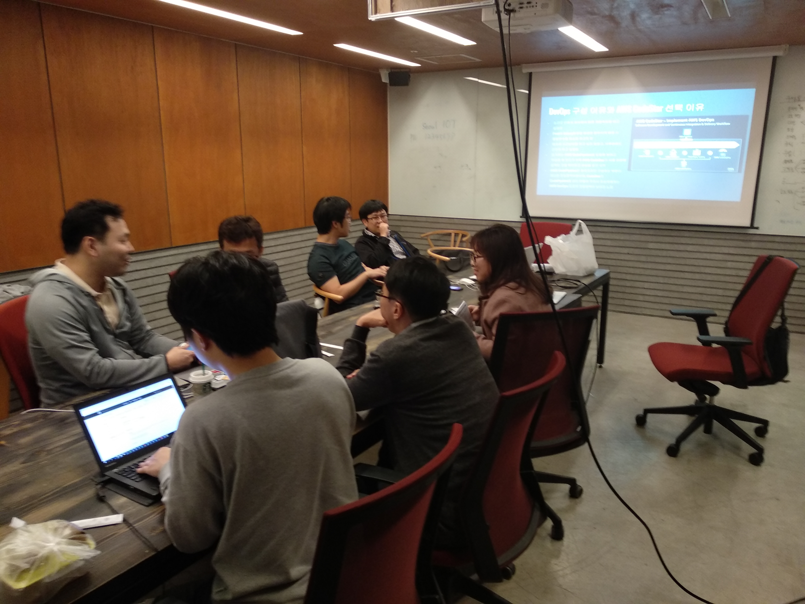

  
20th meetup - <b>[DevOps Series] Ansible을 활용한 Configuration Management Tool & 활용 사례</b>

  ### `20th meetup`
  - **주최**
    - [2018년 9월 18일 / 서울 구로구 디지털로26길 72 서울창업지원센터(서울IoT센터) 4층 중회의실](https://www.meetup.com/ko-KR/awskrug/events/254435002/)
  - **주제**
    - 발표
      - [`심호진`](https://www.meetup.com/ko-KR/awskrug/members/249060449/)님 - [Ansible을 활용한 Configuration Management Tool & 활용 사례](https://www.slideshare.net/StevenShim/ansible-configuration-management-tool-115582091)

  &nbsp;&nbsp;&nbsp;&nbsp;&nbsp;&nbsp;&nbsp;&nbsp;
  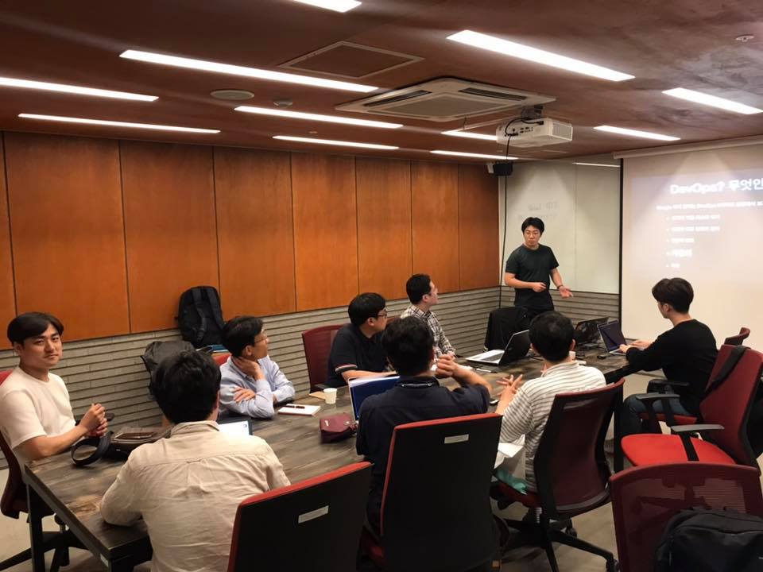
  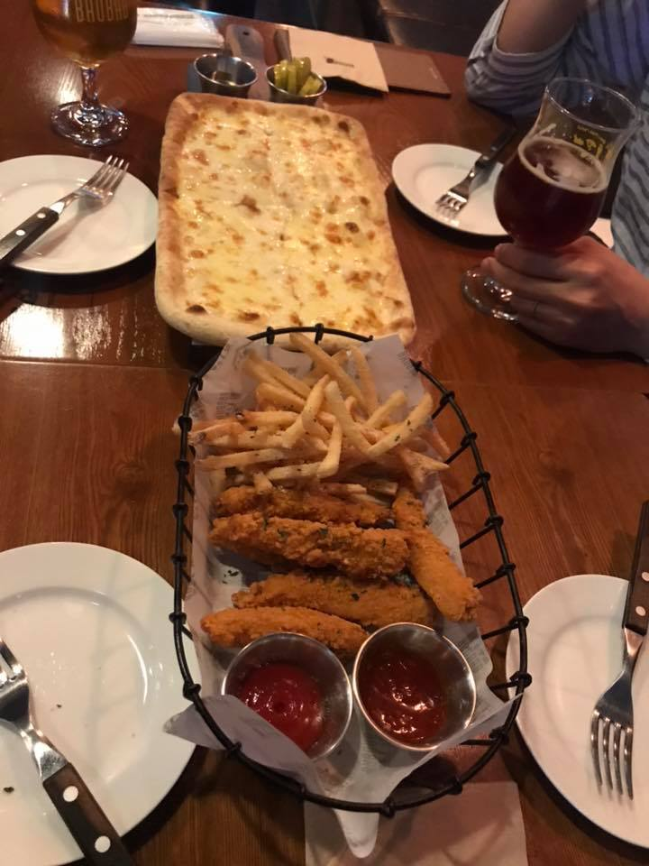

  
19th meetup - <b>container networking with ECS</b>

  ### `19th meetup`
  - **주최**
    - [2018년 7월 24일 / 서울 구로구 디지털로26길 72 서울창업지원센터(서울IoT센터) 4층 중회의실](https://www.meetup.com/ko-KR/awskrug/events/252919658/)
  - **주제**
    - 발표
      - [`류한진`](https://www.meetup.com/ko-KR/awskrug/members/217184134/)님 - container networking with ECS
    - **상반기 회식**
      - 치맥 파티 🍻🍗

  &nbsp;&nbsp;&nbsp;&nbsp;&nbsp;&nbsp;&nbsp;&nbsp;
  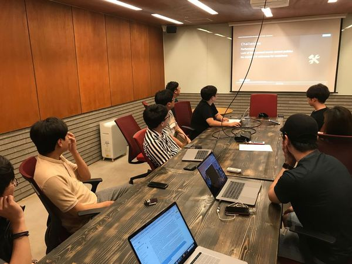

  
18th meetup - <b>CloudFront+S3를 활용한 CDN 구성법</b>

  ### `18th meetup`
  - **주최**
    - [2018년 6월 18일 / 서울 구로구 디지털로26길 72 서울창업지원센터(서울IoT센터) 4층 중회의실](https://www.meetup.com/ko-KR/awskrug/events/251465327/)
  - **주제**
    - 발표
      - [`방신철`](https://www.meetup.com/ko-KR/awskrug/members/254952771/)님 - [CloudFront+S3를 활용한 CDN 구성법, 간단하게 CDN을 활용한 이미지 불러오는 실습까지~!](https://github.com/BangShinChul/AWS-CloudFront-S3)

  
17th meetup - <b>Lambda 로컬테스트부터 배포까지</b>

  ### `17th meetup`
  - **주최**
    - [2018년 5월 15일 / 서울 구로구 디지털로26길 72 서울창업지원센터(서울IoT센터) 4층 중회의실](https://www.meetup.com/ko-KR/awskrug/events/250393682/)
  - **주제**
    - 발표
      - [`박태성`](https://www.meetup.com/ko-KR/awskrug/members/184515293/)님 - [Lambda 로컬테스트부터 배포까지](https://www.slideshare.net/TaeSeongPark2/awskruglambda)

  
16th meetup - <b>자율주제</b>

  ### `16th meetup`
  - **주최**
    - [2018년 4월 24일 / 서울 구로구 디지털로26길 72 서울창업지원센터(서울IoT센터) 4층 중회의실](https://www.meetup.com/ko-KR/awskrug/events/249765339/)
  - **주제**
    - 발표
      - [`신새봄`](https://www.meetup.com/ko-KR/awskrug/members/244752382/)님 - 새로운 사업구상에 끼어 있는 AWS

  
15th meetup - <b>AWS와 만나기 까지 & ASG 끝판왕 깨기</b>

  ### `15th meetup`
  - **주최**
    - [2018년 3월 20일 / 서울 구로구 디지털로26길 72 서울창업지원센터(서울IoT센터) 4층 중회의실](https://www.meetup.com/ko-KR/awskrug/events/248466766/)
  - **주제**
    - 발표
      - [`이재구`](https://www.meetup.com/ko-KR/awskrug/members/244206255/)님 - AWS와 만나기 까지
      - [`이영경`](https://www.meetup.com/ko-KR/awskrug/members/221866187/)님 - [ASG 끝판왕 깨기](http://sori-nori.gitlab.io/youngkyung-done/ASG-1/)

  &nbsp;&nbsp;&nbsp;&nbsp;&nbsp;&nbsp;&nbsp;&nbsp;
  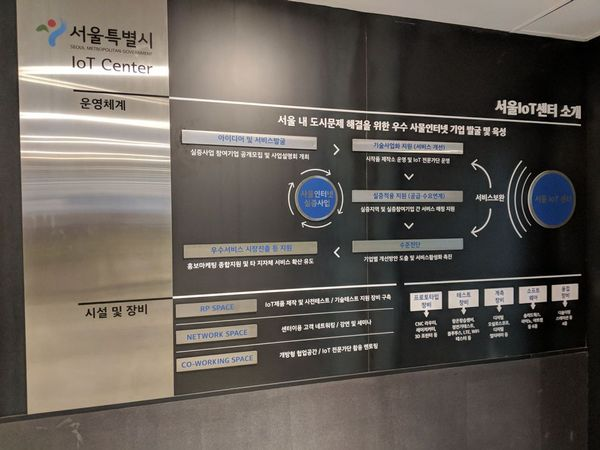
  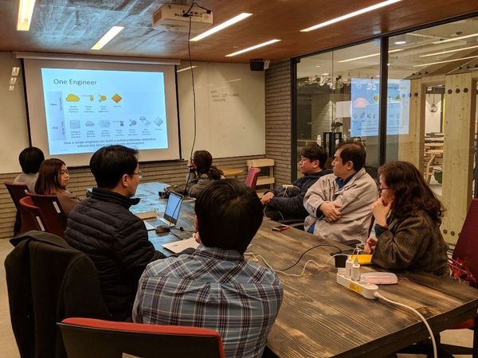

  
14th meetup - <b>나의 SM이용기 & 일본 고베 Alexa Days 참관/여행기</b>

  ### `14th meetup`
  - **주최**
    - [2018년 2월 20일 / 서울특별시 금천구 가산디지털1로 168 우림라이온스밸리 A동 612호 창의지대 회의실](https://www.meetup.com/ko-KR/awskrug/events/247268216/)
  - **주제**
    - 발표
      - [`장강홍`](https://www.meetup.com/ko-KR/awskrug/members/224352392/)님 - [나의 SM이용기](https://drive.google.com/open?id=1KH4-Eqrn1pH_0jlhd-LsFe9gZcwUfWIG)
      - [`김현민`](https://www.meetup.com/ko-KR/awskrug/members/194461433/)님 - 일본 고베 Alexa Days 참관/여행기 (부제 ~AWS와 함께한 세미나~)

  
13th meetup - <b>2017 AWS re:Invent 후기 - Amazon Aurora & Amazon MQ</b>

  ### `13th meetup`
  - **주최**
    - [2018년 1월 17일 / 서울 서대문구 연희로2길 62 한빛미디어 A동 2층 <한빛강의실 20>](https://www.meetup.com/ko-KR/awskrug/events/246703948/)
  - **주제**
    - 발표
      - [`김영헌`](https://www.meetup.com/ko-KR/awskrug/members/222799421/)님 - 2017 AWS re:Invent recap: Amazon Aurora
      - [`장준엽`](https://www.meetup.com/ko-KR/awskrug/members/222640239/)님 - 2017 re:Invent 신규 서비스 사용기 - Amazon MQ

## 2017년

  
12th meetup - <b>Cloudwatch with Slack(slack으로 일하기)</b>

  ### `12th meetup`
  - **주최**
    - [2017년 11월 21일 / 서울특별시 구로구 디지털로 33길 12, 우림 e 비즈 2차 202호 ((주)이오 에스엔씨(IO S&C))](https://www.meetup.com/ko-KR/awskrug/events/245226473/)
  - **주제**
    - 발표
      - [`류한진`](https://www.meetup.com/ko-KR/awskrug/members/217184134/)님 - [Cloudwatch with Slack(slack으로 일하기)](https://docs.google.com/presentation/d/e/2PACX-1vRqZexRpVH6W-filJJqUyaGRWZfBk94niotptPYHmqkgmnZQk0_dI1B3w7id_MvhYNcpeu134O8uirt/pub?start=false&loop=false&delayms=60000&slide=id.p)

  &nbsp;&nbsp;&nbsp;&nbsp;&nbsp;&nbsp;&nbsp;&nbsp;
  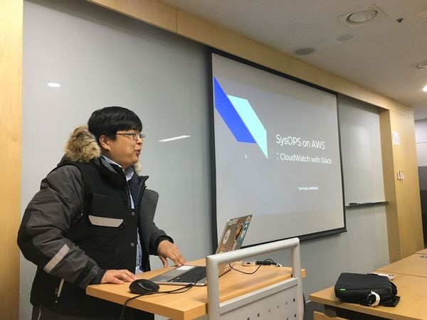
  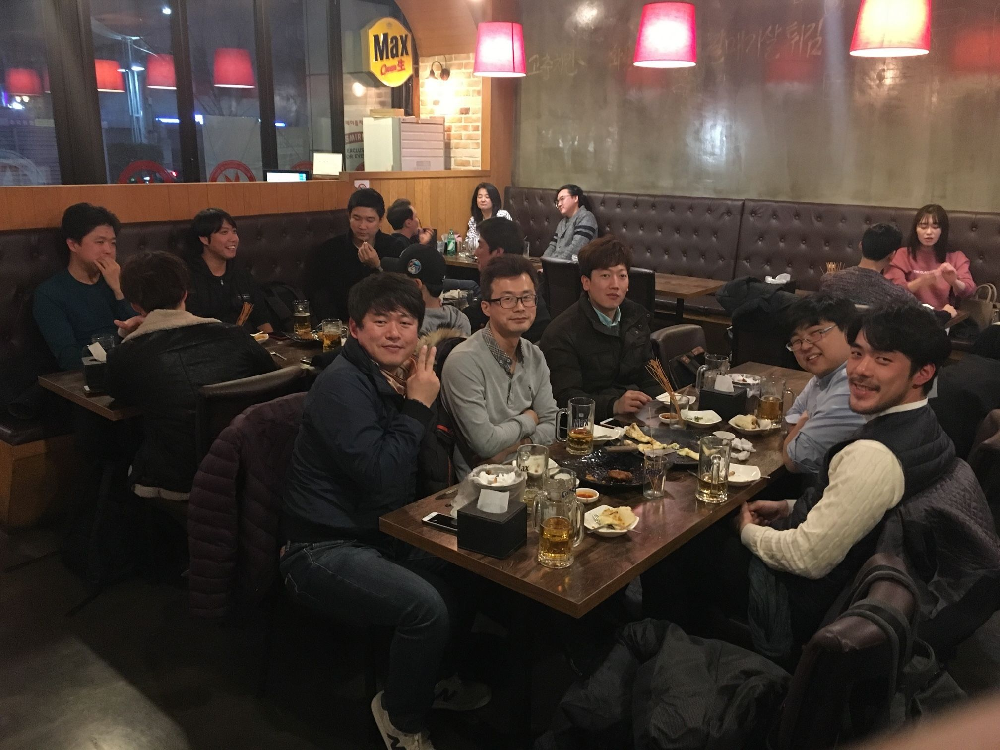

  
11th meetup - <b>5년차 스타트업의 "자율근무와 AWS" 적용사례</b>

  ### `11th meetup`
  - **주최**
    - [2017년 10월 24일 / 서울특별시 구로구 디지털로 33길 12, 우림 e 비즈 2차 202호 ((주)이오 에스엔씨(IO S&C))](https://www.meetup.com/ko-KR/awskrug/events/244305778/)
  - **주제**
    - 발표
      - [`박민준`](https://www.meetup.com/ko-KR/awskrug/members/225821213/)님 - 5년차 스타트업의 "자율근무와 AWS" 적용사례

  
10th meetup - <b>RDS Aurora 생초보 unboxing</b>

  ### `10th meetup`
  - **주최**
    - [2017년 9월 26일 / 서울특별시 구로구 디지털로 33길 12, 우림 e 비즈 2차 202호 ((주)이오 에스엔씨(IO S&C))](https://www.meetup.com/ko-KR/awskrug/events/243387487/)
  - **주제**
    - 발표
      - [`김창겸`](https://www.meetup.com/ko-KR/awskrug/members/221873245/)님 - [RDS Aurora 생초보 unboxing](https://www.slideshare.net/changkyumkim/rds-aurora-unboxing-80367207)

  &nbsp;&nbsp;&nbsp;&nbsp;&nbsp;&nbsp;&nbsp;&nbsp;
 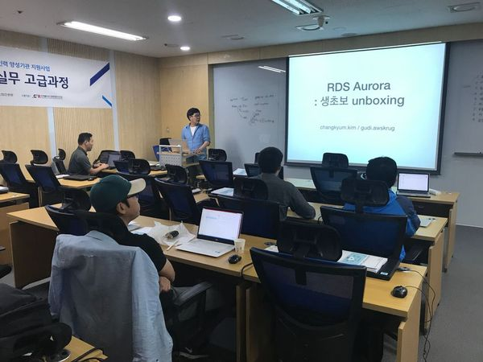

  
9th meetup - <b>CodeStar와 MobileHub 사용기 & Amazon Seattle방문후기</b>

  ### `9th meetup`
  - **주최**
    - [2017년 9월 5일 / 서울특별시 구로구 디지털로 33길 12, 우림 e 비즈 2차 202호 ((주)이오 에스엔씨(IO S&C))](https://www.meetup.com/ko-KR/awskrug/events/242911924/)
  - **주제**
    - 발표
      - [`강효진`](https://www.meetup.com/ko-KR/awskrug/members/221900557/)님 - [AWS DevOps 준비운동 - CodeStar와 MobileHub으로 보는 웹과 모바일의 개발/운영 비교](https://www.slideshare.net/kaojinz/aws-codestar-aws-mobilehub)
      - [`김영헌`](https://www.meetup.com/ko-KR/awskrug/members/222799421/)님 - Amazon-시애틀 방문(여행) 후기

  
8th meetup - <b>개발과 운영의 조화 DevOps, 여러분은 어떻게 생각하시나요?</b>

  ### `8th meetup`
  - **주최**
    - [2017년 8월 16일 / 서울특별시 구로구 디지털로 33길 12, 우림 e 비즈 2차 202호 ((주)이오 에스엔씨(IO S&C))](https://www.meetup.com/ko-KR/awskrug/events/242238839/)
  - **주제**
    - 발표
      - DevOps에 대한 생각을 가진 능동적이신 밋업 참가자분들 - [개발과 운영의 조화 DevOps](https://docs.google.com/presentation/d/1Edqu8gmXnX4wvXXCpfNbeq4LqfDVUfsbQsxstQt1Yfg/edit#slide=id.g2405689757_0_59)
    
  &nbsp;&nbsp;&nbsp;&nbsp;&nbsp;&nbsp;&nbsp;&nbsp;
  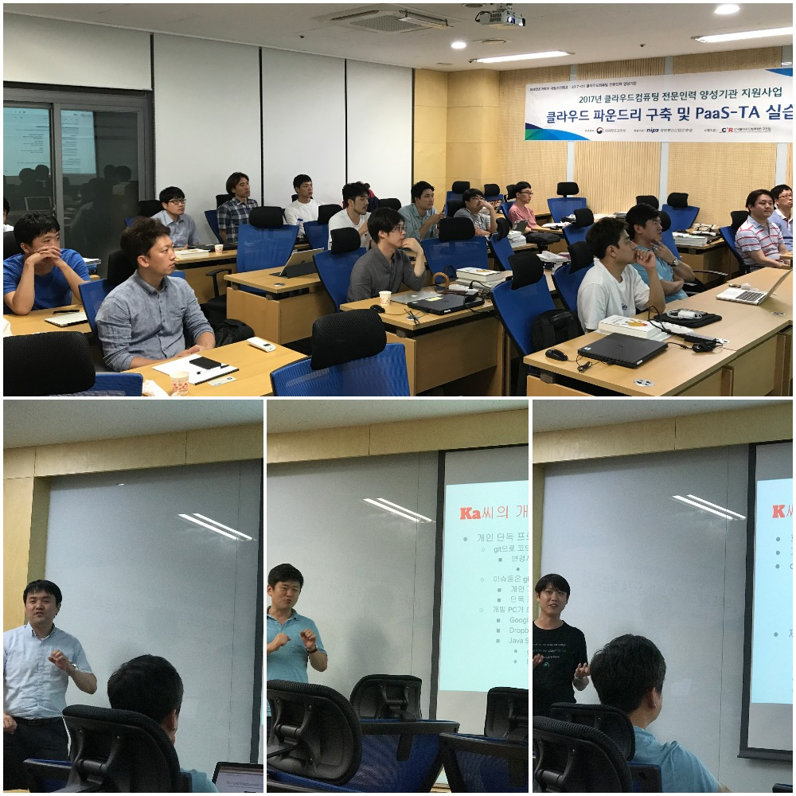
  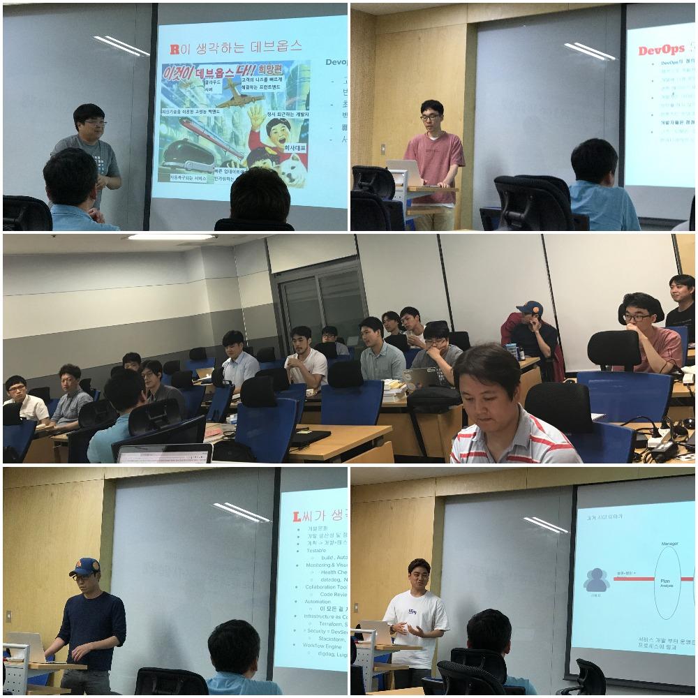

  
7th meetup - <b>AWS Community Days Review</b>

  ### `7th meetup`
  - **주최**
    - [2017년 7월 26일 / 서울특별시 구로구 디지털로 33길 12, 우림 e 비즈 2차 202호 ((주)이오 에스엔씨(IO S&C))](https://www.meetup.com/ko-KR/awskrug/events/241776984/)
  - **주제**
    - 발표
      - [`강효진`](https://www.meetup.com/ko-KR/awskrug/members/221900557/)님 - [ElasticBeanstalk - 콩과의 대화](https://www.slideshare.net/awskr/elasticbeanstalk-77390280)
      - [`김영헌`](https://www.meetup.com/ko-KR/awskrug/members/222799421/)님 - [개인 지출 관리, AWS Lambda로 시작하기](https://youtu.be/OXpJSKcl_Jg)

  
6th meetup - <b>AWS Greenglass맛보기 & tyle에서 사용한 AWS 후기</b>

  ### `6th meetup`
  - **주최**
    - [2017년 7월 5일 / 서울특별시 구로구 디지털로 33길 12, 우림 e 비즈 2차 202호 ((주)이오 에스엔씨(IO S&C))](https://www.meetup.com/ko-KR/awskrug/events/241106610/)
  - **주제**
    - 발표
      - [`김현민`](https://www.meetup.com/ko-KR/awskrug/members/194461433/)님 - AWS Greenglass 맛보기
      - [`박관웅`](https://www.meetup.com/ko-KR/awskrug/members/204876774/)님 - [나는 “tyle”에서 AWS를 이렇게 구축(사용)했다.](https://www.slideshare.net/pouu69/tyle-aws)

  &nbsp;&nbsp;&nbsp;&nbsp;&nbsp;&nbsp;&nbsp;&nbsp;
  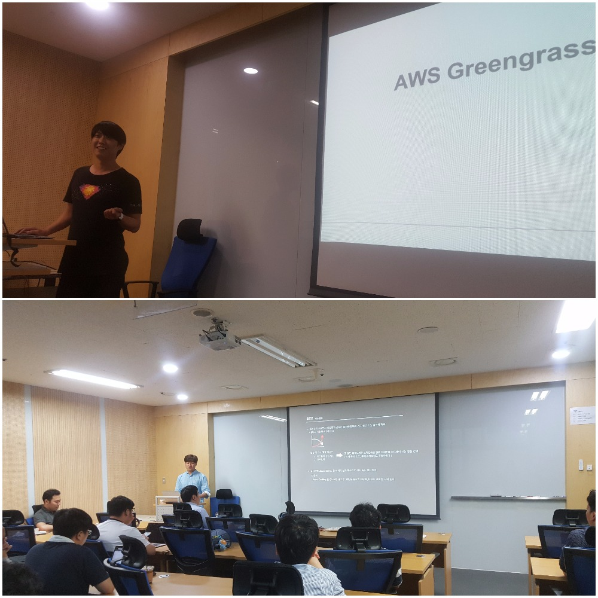

  
5th meetup - <b>Alexa,Docker사용기 & 금융권 클라우드 이용기</b>

  ### `5th meetup`
  - **주최**
    - [2017년 6월 7일 / 서울특별시 구로구 디지털로 33길 12, 우림 e 비즈 2차 202호 ((주)이오 에스엔씨(IO S&C))](https://www.meetup.com/ko-KR/awskrug/events/240281253/)
  - **주제**
    - 발표
      - [`이수현`](https://www.meetup.com/ko-KR/awskrug/members/223236692/)님 - [Alexa는 Docker도 춤추게 한다](https://www.slideshare.net/ssuserdaed291/alexa-docker)
      - [`장강홍`](https://www.meetup.com/ko-KR/awskrug/members/224352392/)님 - [금융권 클라우드 이용기](https://www.slideshare.net/secret/4ZRbX4mF8fC7G7)

  &nbsp;&nbsp;&nbsp;&nbsp;&nbsp;&nbsp;&nbsp;&nbsp;
  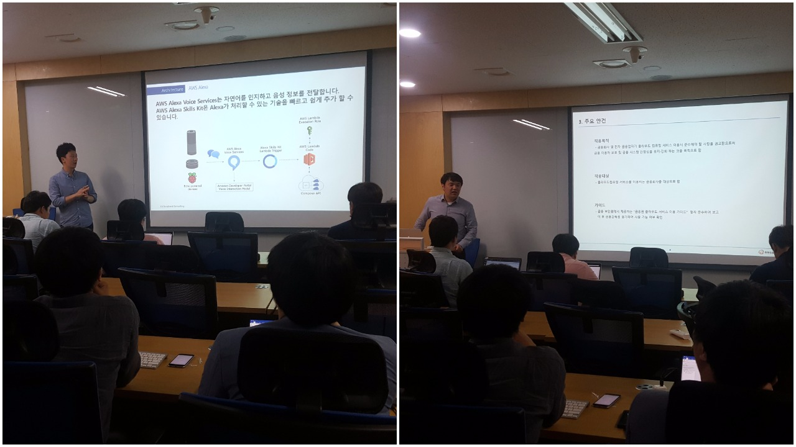

  
4th meetup - <b>대규모 트래픽 견디기 & 팬사이트 구축 경험기</b>

  ### `4th meetup`
  - **주최**
    - [2017년 5월 16일 / 서울특별시 구로구 디지털로 33길 12, 우림 e 비즈 2차 202호 ((주)이오 에스엔씨(IO S&C))](https://www.meetup.com/ko-KR/awskrug/events/239719446/)
  - **주제**
    - 발표
      - [`장준엽`](https://www.meetup.com/ko-KR/awskrug/members/222640239/)님 - [대규모 트래픽 잘 견디기](https://docs.google.com/presentation/d/13aLidEukUS1dy1RV18RCR9J-NSED5jzTSZigd9DnRaY/edit#slide=id.p)
      - [`고봉석`](https://www.meetup.com/ko-KR/awskrug/members/223436843/)님 - 덕후의 AWS를 이용한 팬사이트 구축 실패 경험기

  &nbsp;&nbsp;&nbsp;&nbsp;&nbsp;&nbsp;&nbsp;&nbsp;
  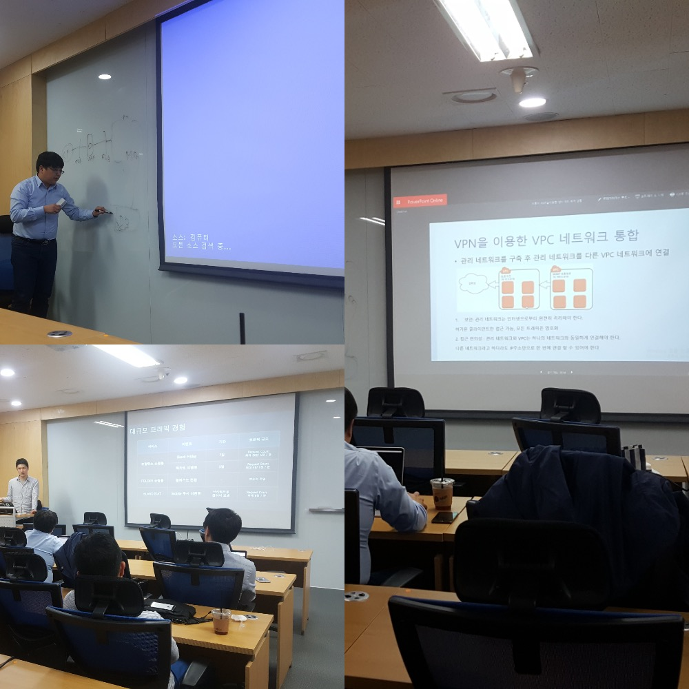

  
3th meetup - <b>Elastic Load Balancing : swimming lightly and my practice & 덕후의 AWS를 이용한 팬사이트 구축 실패 경험기</b>

  ### `3th meetup`
  - **주최**
    - [2017년 4월 25일 / 서울특별시 구로구 디지털로 33길 12, 우림 e 비즈 2차 202호 ((주)이오 에스엔씨(IO S&C))](https://www.meetup.com/ko-KR/awskrug/events/239093516/)
  - **주제**
    - 발표
      - [`류한진`](https://www.meetup.com/ko-KR/awskrug/members/217184134/)님 - [Elastic Load Balancing : swimming lightly and my practice](https://docs.google.com/presentation/d/1SVqdeGNAcWFDnCI8iyXFzdN9jKGvHHnuZzBgJKUon80/pub?start=false&loop=false&delayms=4000)
      - [`이영경`](https://www.meetup.com/ko-KR/awskrug/members/221866187/)님 - 덕후의 AWS를 이용한 팬사이트 구축 실패 경험기

  &nbsp;&nbsp;&nbsp;&nbsp;&nbsp;&nbsp;&nbsp;&nbsp;
  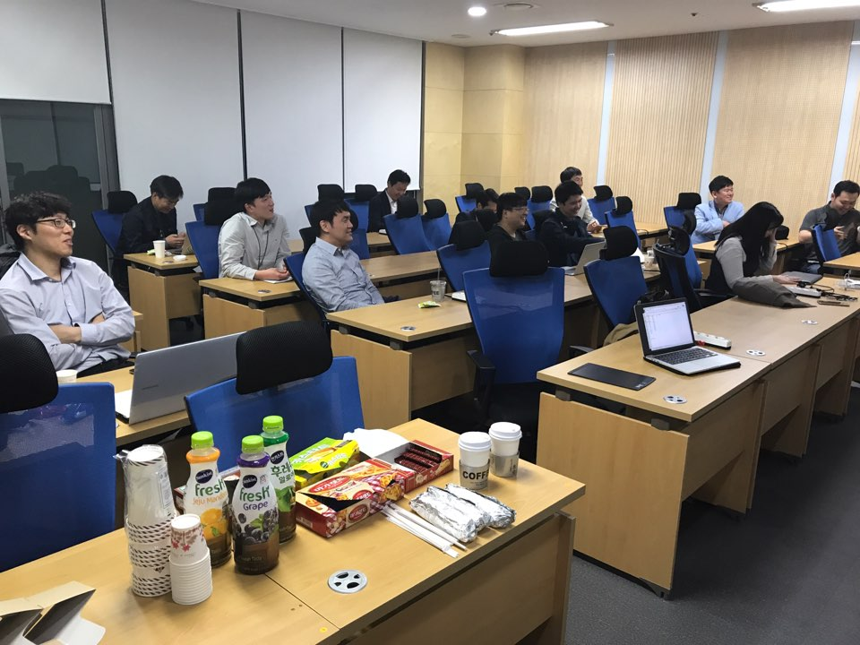

  
2th meetup - <b>Lambda & ElasticBeansTalk 사용기 & EC2 Deep Dive</b>

  ### `2th meetup`
  - **주최**
    - [2017년 4월 6일 / 서울특별시 구로구 디지털로 33길 12, 우림 e 비즈 2차 202호 ((주)이오 에스엔씨(IO S&C))](https://www.meetup.com/ko-KR/awskrug/events/238411836/)
  - **주제**
    - 발표
      - [`김영헌`](https://www.meetup.com/ko-KR/awskrug/members/222799421/)님 - [나의 AWS 첫걸음 - Lambda로 시작하는 나의 지출 데이터 수집](https://www.slideshare.net/YoungKim15/aws-lambda-74604471)
      - [`강효진`](https://www.meetup.com/ko-KR/awskrug/members/221900557/)님 - [ElasticBeansTalk - 콩과의 첫 대화](https://docs.google.com/presentation/d/14_n-QMHdAx2lIl-mhBsVnfrTUMR6RoKQWWUSAje9ZUs/edit?usp=sharing)
      - [`정도현`](https://www.meetup.com/ko-KR/awskrug/members/216996214/)님 - [EC2 Deep Dive](https://www.slideshare.net/AmazonWebServices/aws-reinvent-2016-deep-dive-on-amazon-ec2-instances-featuring-performance-optimization-best-practices-cmp301)

  &nbsp;&nbsp;&nbsp;&nbsp;&nbsp;&nbsp;&nbsp;&nbsp;
  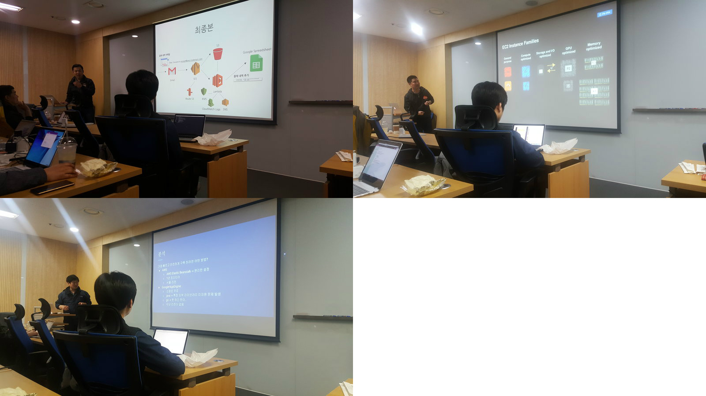

  
1th meetup - <b>JAWS Days 참관 후기</b>

  ### `1th meetup`
  - **주최**
    - [2017년 3월 13일 / 서울특별시 구로구 디지털로 33길 12, 우림 e 비즈 2차 202호 ((주)이오 에스엔씨(IO S&C))](https://www.meetup.com/ko-KR/awskrug/events/238137039/)
  - **주제**
    - 발표
      - [`이준희`](https://www.meetup.com/ko-KR/awskrug/members//)님 - [JAWS Days 참관 후기](http://www.slideshare.net/JoonHeeLee14/2017-jaws-days-24-20170313)
      - [`신승우`](https://www.meetup.com/ko-KR/awskrug/members//)님 - 이미지스토리지 AWS S3로 이사 가기

  &nbsp;&nbsp;&nbsp;&nbsp;&nbsp;&nbsp;&nbsp;&nbsp;
  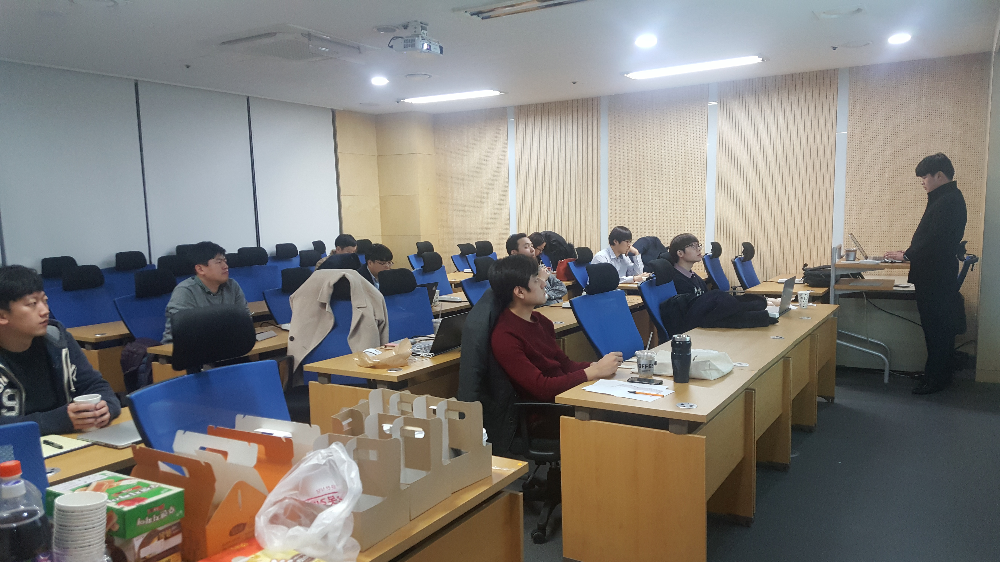

